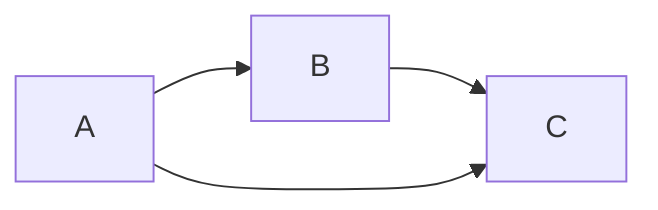
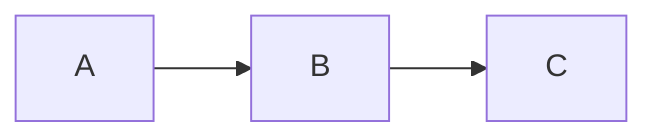

지난 글에서는 LiNGAM 알고리즘이 어떻게 돌아가는지 로직을 들여다보았다. 하지만 우리가 이렇게 얻은 $\widetilde{\mathbf{B}}$ 가 얼마나 믿을 수 있는지 알 방법이 있어야 하지 않을까? 이번에는 통계적 검정방법에 대해서 알아보자.

<!--more-->

## Statistical Tests for Pruning Edges

> The good news is that, in some caes, it is possible to detect violations of the model assumptions. In the following sections, we provide three statistical tests: i) testing significane of $b_{ij}$ for pruning edges; ii) examining an overall fit of the model assumptions including estimated structure and connection strengths to data; iii) comparing two nested models. The we propose a method for pruning edges of an estimated network using these statistical tests.

### Wald Test for Examining Significance of Edges

우선 Wald Test에 관해서는 <a href="https://junhyoung-chung.github.io/2023/01/28/LRT.html">이 포스트</a> 를 참고하자.

논문에서는 다음과 같은 가설 검정을 제안한다.

$$
H_0: \widetilde{w}_{ij}=0 \quad H_1: \widetilde{w}_{ij} \neq 0 
$$

or

$$
H_0: b_{ij}=0 \quad H_1: b_{ij} \neq 0 
$$

통계량으로는

$$
\frac{\widetilde{w}_{ij}^2}{avar(\widetilde{w}_{ij})}
$$

을 사용한다. $\widehat{\mathbf{B}}$가 $\widetilde{\mathbf{W}}$ 로부터 나오기 때문에 가설검정의 형태는 표현만 다르지 사실상 같다는 점을 유의하자. 그리고 이 통계량은 근사적으로 $\chi^2(1)$ 분포를 따른다.

### A Chi-Square Test for Evaluating the Overall Fit of the Estimated Model

> 여기가 살짝 이해가 잘 안 되는데,, 일단 쭉 리뷰해보자.

#### Moment Structures of Models

우선

$$
\mathbf{x}=(\mathbf{I}-\mathbf{B})^{-1}\mathbf{e}
$$

인 걸 다시 한번 상기하자. 편의상 $\mathbf{x}$의 평균은 0이라고 가정을 할 때 분산은 어떻게 될까? 평균이 0이라는 가정에서 살짝 의심스럽다면 우리가 ICA에서 자료를 centering하고 시작했다는 걸 기억하자.

$$
Var(\mathbf{x})=E(\mathbf{x}\mathbf{x}^T)=(\mathbf{I}-\mathbf{B})^{-1}\Sigma {(\mathbf{I}-\mathbf{B})^{-1}}^{T}
$$

그러고 나서 논문은 다음과 같은 $\sigma_2(\tau)$를 정의한다.

$$
\sigma_2(\tau)=\text{vec}^{+}\left\{ E(\mathbf{x}\mathbf{x}^T) \right\}
$$

여기서 $\text{vec}^+$라는 개념은 <a href="https://ko.wikipedia.org/wiki/벡터화">여기</a>를 참고하자. 그리고 논문에서 symmetry한 부분은 중복을 없앤다고 했다. 그니까 아마

$$
\sigma_2(\tau)=\begin{bmatrix}
E(x_1x_1) \\
E(x_2x_1) \\
\vdots \\
E(x_mx_1) \\
E(x_2x_2) \\
E(x_3x_2) \\
\vdots \\
E(x_mx_m)
\end{bmatrix}
$$

으로 $\frac{m(m+1)}{2} \times 1$ 차원의 열벡터가 될 것이다.

$\tau$를 어떻게 말하고 있냐면,

> the vector of statistics of disturbances and coefficients of $\mathbf{B}$ that uniquely determines the second-order moment structures of the model $\sigma_2(\tau)$

이게 무슨 뜻일까...? 추가적으로

> The parameter vector $\tau$ consists of free parameters of $\mathbf{B}$ and $E(e_i^2)$.

아마 식 (5)에서 $E(\mathbf{x}\mathbf{x}^T)$ 를 유일하게 결정지을 수 있는 coefficients들을 모아놓았다는 말인 듯 한데 아직 정확히 와닿지가 않는다.. 일단 넘어가자.

이제 $\mathbf{x}_1,\dots,\mathbf{x}_n$ 의 sample이 관찰된 경우를 생각하자. 그럼 우리는 $\sigma_2(\tau)$의 대용으로 다음과 같은 추정량을 찾을 것이다.

$$
m_2=\frac{1}{n}\sum_{j=1}^{n}\text{vec}^+(\mathbf{x}_j\mathbf{x}_j^T)
$$

여기서 $m_2 \overset{p}{\to} \sigma_2(\tau_0)$ 인걸 생각하면, $n$이 충분히 클 때 둘은 비슷한 값을 가지게 될 것이다. $\tau_0$은 true parameter을 말한다.

이 때, 논문에서는 다음과 같은 가설검정을 제안한다.

$$
H_0: E(m_2)=\sigma_2(\tau) \quad H_1: E(m_2) \neq \sigma_2(\tau) 
$$

이 떄 $\mathbf{V}$를 $m_2$의 공분산 행렬, $\widehat{\mathbf{V}}$를 $m_2$의 표본공분산 행렬로 정의한다.

그리고 $\mathbf{J}=\partial\sigma_2(\tau)/\partial\tau^T$로 정의할 때 다음과 같은 통계량을 생각하자.

$$
F(\hat{\tau})=\left\{ m_2-\sigma_2(\hat{\tau}) \right\}^T\widehat{\mathbf{M}}\left\{ m_2-\sigma_2(\hat{\tau}) \right\}
$$

where

$$
\widehat{\mathbf{M}} = \widehat{\mathbf{V}}^{-1}-\widehat{\mathbf{V}}^{-1}\widehat{\mathbf{J}}(\widehat{\mathbf{J}}^T\widehat{\mathbf{V}}^{-1}\widehat{\mathbf{J}})^{-1}\widehat{\mathbf{J}}^T\widehat{\mathbf{V}}^{-1}
$$

$$
\widehat{\mathbf{J}}=\frac{\partial{\sigma_2(\tau)}}{\partial{\tau^T}} \bigg|_{\tau=\hat{\tau}}
$$

으아 모르겠다.. 

하튼 이때 $T_1=n \times F(\hat{\tau})$는 귀무가설 하에서 근사적으로 자유도가 $u-\nu$ 인 카이제곱분포를 따르는데, $u$는 $m_2$의 차원, $\nu$는 $\tau$의 차원을 말하는 듯 하다.

하나하나 무슨 말을 하는지는 대충 알겠는데, 이게 정확히 왜 그런지는 모르겠다. 

$$
T_2 = \frac{T_1}{1+F(\hat{\tau})}
$$

가 더 카이제곱분포에 흡사하다는 것이 Yuan and Bentler(1997) 논문에서 밝혀졌다고 한다. 그래서 이 논문에서는 $T_2$를 검정통계량으로 사용하고 있다.

#### A Difference Chi-Square Test for Model Comparison of Nested Models

보통 머신러닝에서 모형 적합을 할 때 성능을 많이 잃지 않는 선에서 보다 단순한 모형을 찾곤 한다. 과적합의 우려도 있고 모형이 복잡할수록 시간,비용 등이 더욱 소모되기 때문이다. 선형회귀분석으로 예를 한번 들어보자.

$$
\text{Full Model}: \mathbf{y}=\mathbf{X}_r\beta_r+\mathbf{X}_p\beta_p+\epsilon
$$

$$
\text{Reduced Model}: \mathbf{y}=\mathbf{X}_r\beta_r+\epsilon
$$

만약 Reduced Model이 Full Model에 비해 성능이 크게 뒤처지지 않는다면 우리는 Reduced Model을 선택하게 된다. 다만, 이 "성능"이라는 것을 어떻게 평가할 건지가 중요한 문제인데 보통 회귀분석에서는

$$
H_0 : \beta_p=0 \quad H_1 : \beta_p \neq 0
$$

이라는 가설을 세워 T 검정이나 F 검정을 수행하게 된다.

마찬가지로 

모델과

모델이 큰 차이가 없다면 우리는 보다 단순한 두번쨰 모델을 선호하게 될 것이다. 이처럼 복잡한 모델과 단순한 모델이 유의미하게 차이가 있는지를 검정할 수 있는 방법에 대해 소개하고 있는 부분이라고 이해하면 될 듯 하다.

Model 1은 $q$개의 edge를 가지고 있고 이 떄의 통계량을 $T_2(q)$ 로 나타내자. 그리고 Model 1에서 edge를 하나 쳐내 총 $q-1$개의 edge를 가지고 있는 Model 2의 통계량을 $T_2(q-1)$으로 나타낼 때, $T_2(q)-T_2(q-1)$은 근사적으로 $\chi^2(1)$ 분포를 따른다고 한다. 아마 $T_2(q)$는 항상 $T_2(q-1)$보다 클 것이다.

그렇다면 이러한 가설검정을 어떻게 활용할 수 있을까?

엄청 복잡한 모델을 우리가 맨 처음에 얻었다고 생각해보자. 그 때부터 이 가설검정을 활용해 edge를 하나씩 쳐내는 거다. 처음에는 아무래도 귀무가설을 기각하지 못할 것이다. 그렇게 계속 edge를 쳐내다가 어느 순간 귀무가설을 기각해야 할 때가 올 것이다. 그 순간의 모델을 최종적으로 선택하는 것이다.

### A Method for Pruning Edges

위에서 말한 활용방안을 알고리즘화하여 나타내면 아래와 같다.

&lt;Algorithm D&gt;

1. Set a significance level $\alpha$.
2. Find non-significant edges by applying Wald test to edge.
3. Set the least significant strictly lower triangular element of $\widetilde{\mathbf{B}}$ (in Step 5 of the LiNGAM discovery algorithm) among the non-significant edges accepted by Wald test to zero.
4. Repeat until all the non-significant edges by Wald test are examined.
  * Test if the overall model fits for the last model and current model with one less edge than th elast model are significantly different by the difference test. Further test the model fit of the current model by the chi-square test. If both null hypotheses are accepted in the two tests, adopt the current model, that is, prune the edge out. Otherwise, adopt the last model, that is, do not prune the edge.
  * Additionally set the next least significant element of $\widetilde{\mathbf{B}}$ to zero.
5. Return the pruned $\widetilde{\mathbf{B}}$.

우선 유의수준 $\alpha$를 정한다. 그리고 우리가 맨 처음 획득한 모델에 대해서 Wald Test를 통해 유의미하지 않은 edge들 중 대각 밑부분에 있으면서 가장 유의미하지 않은 원소 하나를 0으로 바꿔버린다. 아마 가장 유의미하지 않은 원소라 함은 p-value가 가장 크게 나타난 원소일 것이다.

그 다음 4번 알고리즘을 시작한다.

우선 아까 edge를 0으로 바꾼 Reduced Model과 Full Model에 대해 Difference Test를 수행하고, Reduced Model에 대해 Chi-Square Test를 수행한다. 만약 둘 다 귀무가설을 기각하지 못했다면 해당 edge를 0으로 바꾸고 넘어간다. 만약 하나라도 기각되었다면 아무런 조치를 취하지 않고 넘어간다. 그리고 그 다음으로 가장 유의미하게 나타나지 않았떤 edge를 0으로 바꾸고 4번 알고리즘을 시작한다.

4번 알고리즘까지 끝나면 strictly lower triangular element들에 대해서는 모두 가지치기가 끝난 상태일 것이다. 이 떄 우리가 가지고 있는 $\widetilde{\mathbf{B}}$가 최종 모델이다.

주의해야 할 점은 이러한 알고리즘에서는 <a href="https://junhyoung-chung.github.io/2023/01/29/MultipleComparison.html">multiple comparison</a> 문제 때문에 유의수준 $\alpha$를 선택하는 것이 생각보다 까다롭다는 점이다. 논문에서는 이를 후속연구로 남겨두고 있다.

## Reference

* <a href="https://www.jmlr.org/papers/volume7/shimizu06a/shimizu06a.pdf">A Linear Non-Gaussian Acyclic Model for Causal Discovery</a>

* <a href="https://ko.wikipedia.org/wiki/치환행렬">치환행렬(Permutation Matrix)</a>

* <a href="https://gazelle-and-cs.tistory.com/29">할당 문제 & 헝가리안 알고리즘 (Assignment Problem & Hungarian Algorithm)</a>