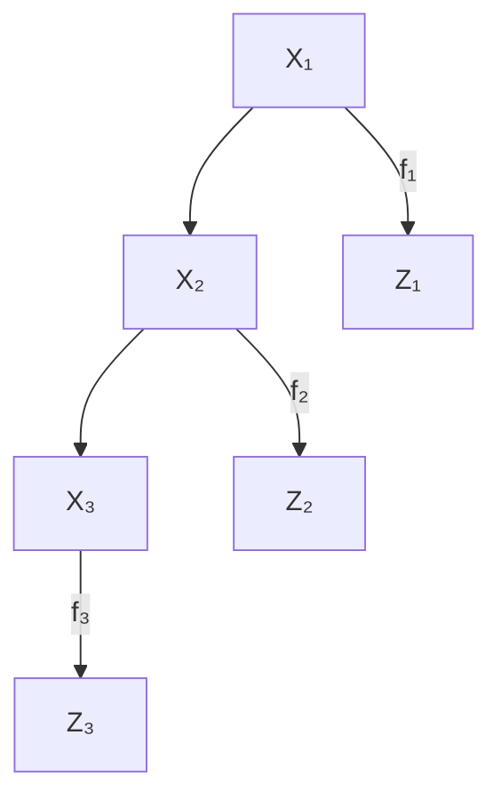
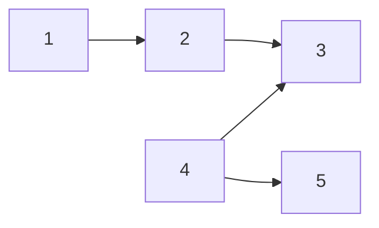

This post is the summary of <a href="https://link.springer.com/article/10.1007/s42952-024-00298-9">Chung, J., Ahn, Y., Shin, D., & Park, G. (2024). Learning distribution-free anchored linear structural equation models in the presence of measurement error. Journal of the Korean Statistical Society, 1-25.</a>

<!--more-->

---

# Objective

This study aims to establish identifiability in distribution-free anchored linear structural equation models(SEMs), where the observed variables are imperfect measures for the target variables. Based on the identifiability condition, a consistent learning algorithm of the complete partial directed acyclic graph(CPDAG) is developed.

# Contributions

* Establishes an identifiability condition of distribution-free anchored linear SEMs based on the **geometry-faithfulness** assumption.
* Proposes a consistent learning algorithm to discover a latent structure in the presence of measurement error.
* Provides various numerical experiments and analysis of real galaxy data.

# Introduction

* Identifiability of directed acyclic graphical models (DAG) is usually achieved by posing additional assumptions. For example,
  * **Causal minimality**: True graph is a minimal structure that is Markov to its distribution.
  * **Faithfulness**: Conditional independence implies d-separation.
	* **Distributional constraints**: Gaussian errors with equal variance (Peters and Bühlmann, 2014), non-Gaussian errors (Shimizu et al., 2006), etc.
* The aforementioned identifiability results work under **causal sufficiency** regime, excluding the presence of latent variables.
* However, in many real-world setting, observed variables are **imperfect measures** of corresponding true variables.

## Motivating example

* The above figure visualizes the relationship between the latent variables $X$ and the observed variables $Z$.
* One can observe that $X_1$ and $X_3$ are d-separated(blocked) by $X_2$, while the statement becomes false if we replace $X$ to $Z$.

## Preliminaries

### Directed acyclic graph

* A DAG $\mathcal{G} = (V,E)$ consists of a set of nodes $V = \{1,...,p\}$ and a set of directed edges $E \subset V \times V$ with no directed cycles. Its **skeleton** is an undirected graph obtained by removing directions in the edges.
* A set of **parents** of node $k$, denoted by $\text{Pa}(k)$, consists of all nodes $j$ such that $(j,k) \in E$.
  * $\text{Pa}(3) = \{2,4\}$.
* If there is a directed path $j \rightarrow \cdots \rightarrow k$, then $k$ is a **descendant** of $j$, and $j$ is called an **ancestor** of $k$.
  * $1$ is an ancestor of $3$, and $3$ is a descendant of $1$.
* A node $k$ is a **collider** if there exists a triple $(j,k,\ell)$ such that $j \rightarrow k \leftarrow \ell$, and we say such triple generates a **v-structure**.
  * $3$ is a collider.

### D-separation and d-connection

* Two nodes $j$ and $k$ in DAG $\mathcal{G}$ are **d-connected by a node set** $S \subset V$ if there exists a path $\mathcal{P}$ between $j$ and $k$ such that for every node $\ell$ on the path $\mathcal{P}$
  * if $\ell$ is a collider, either $\ell$ or its descendant is in $S$,
  * otherwise $\ell$ is not in $S$.
* If $j$ and $k$ are not d-connected by $S$, we say $j$ and $k$ are **d-separated by** $S$.
  * $1$ and $5$ are d-separated by $\emptyset, \{2\}, \{4\}, \{2,4\}$.
  * $1$ and $5$ are d-connected by $\{3\}$.

