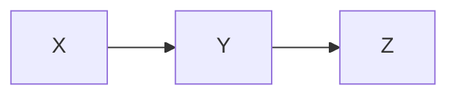
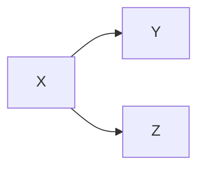
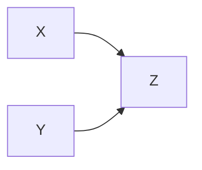
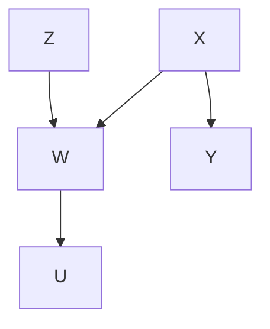
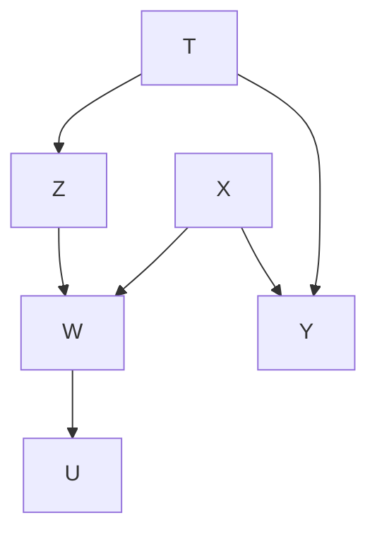

인과모델은 통상적으로 우리가 생각하는 것만큼 그리 단순하지가 않다. 수많은 확률변수들이 서로 얽혀있고, 이를 그래프로 나타내기 시작하면 뭐가 뭔지 알아보기 힘들 정도일 때도 있을 것이다. 과연 확률변수 $A$와 $B$ 사이에 dependecy가 존재하는지를 확인할 수 있을만한 하나의 좋은 rule은 없을까?

<!--more-->

우선 d-separation 개념을 소개하기에 앞서 우리가 먼저 알아야 할 notation들에 대해 익숙해질 필요가 있다.

## Chains

우리는 다음과 같은 모양을 가진 관계를 "chain"이라 부른다.

첫번쨰 확률변수가 두번째 확률변수에 영향을 주고, 두번째 확률변수가 세번째에, 세번째가 네번째에, ... 이런 식이다. 가장 직관적이고 단순한 모양이라 할 수 있다. 마코프 체인이 바로 이 "chain"에 해당하는 사례 중 하나이다.

여기서 $X$와 $Z$는 독립일까? 당연히 아닐 것이다. $Z$는 $Y$를 통해 간접적으로 $X$의 영향을 받기 때문이다.

하지만 $Y$가 주어진 상황이라면 이야기가 달라진다. $Y$가 주어진 순간, $X$는 $Z$와 전혀 상관이 없는 확률변수로 바뀌어버린다. 즉,

$$
P(Z=z \mid X=x,Y=y)=P(Z=z \mid Y=y)
$$

이기 때문에 $Y$가 주어진 상황에서 $X$와 $Z$는 독립이다. 마치 $Y$가 둘의 관계를 끊어버리는 것 같다. 이런 느낌을 잘 기억하자.

## Forks

"fork"는 한 확률변수가 두 개의 확률변수에 동시에 영향을 주는 모양을 말한다.

여기서 $Y$와 $Z$는 당연히 독립이 아니다. $Y$도 $X$의 함수이고, $Z$도 $X$의 함수이기 때문이다. 하지만, "chain"에서와 마찬가지로 $X$가 주어진다면 둘은 독립이다.

$$
P(Z=z \mid Y=y,X=x)=P(Z=z \mid X=x)
$$

## Colliders

"Collider"는 영단어 의미 그대로 충돌하는 모양을 가지고 있다. 확률변수 $Z$가 $X$의 영향도 받지만 $Y$의 영향도 같이 받을 수 있다.

이 때 $X$와 $Y$는 독립이다. 하지만 앞선 모양과 다르게 $Z$가 주어진 순간 $X$와 $Y$는 서로 독립이 아니게 된다.

$$
P(X=x \mid Y=y,Z=z) \neq P(X=x \mid Z=z)
$$

결과가 정해진 이상 두 개의 원인은 서로 dependent할 수밖에 없다는 얘기다. 쉽게 생각해서

$$
X+Y=Z
$$

라는 식을 생각해보자. $Z$가 주어진 순간 $X$와 $Y$는 서로의 값에 영향을 받게 된다. 이러한 의미로 받아들이면 될 듯하다.

## d-Separation

정의를 쓰고 시작하자.

__Definition ($d$-separation)__ A path $p$ is blocked by a set of nodes $S$ if and only if

1. $p$ contains a chain of nodes $A \to B \to C$ or  a fork $A \leftarrow B \to C$ such that middle node $B$ is in $S$ (i.e. $B$ is conditioned on)
2. $p$ contains a collider $A \to B \leftarrow C$ such that the collision node $B$ is not in $S$, and no descendant of $B$ is in $S$.

If $S$ blocks every path between two nodes $X$ and $Y$, then $X$ and $Y$ are $d$-separated, conditional on $S$, and thus are independent conditional on $S$.

즉 $d$-separation이라는 개념을 통해 우리는 변수들 간의 관계를 쉽게 파악할 수 있게 된다.

정의에 대해 생각해볼 수 있는 그래프를 살펴보자.

$Z$와 $Y$를 집중적으로 한번 살펴보려고 한다.

만약 $S=\emptyset$ 라면 어떻게 될까?

$Z \to W \leftarrow X$ 라는 collider가 있음을 생각하자. 하지만 $W$는 $S$에 포함되어 있지 않고, 그의 descendent인 $U$ 역시 마찬가지로 포함되어 있지 않다. 그렇다면 __2번 조건에 따라 $Z$와 $Y$는 독립이다.__

$$
P(Z=z \mid Y=y) = P(Z=z)
$$

그렇다면 $S=\left\\{ W \right\\}$ 가 되는 순간 역시 2번 조건에 따라 $Z$와 $Y$는 dependent해진다는 것을 알 수 있을 것이다. $S=\left\\{ U \right\\}$ 로 잡아도 마찬가지이다.

$$
P(Z=z \mid Y=y,W=w) \neq P(Z=z \mid W=w)
$$

$S=\left\\{ W,X \right\\}$ 이면 어떻게 될까? $W \leftarrow X \to Y$라는 fork 때문에 1번 정의에 따라 $Z$와 $Y$는 독립이다.

$$
P(Z=z \mid Y=y,W=w,X=x) = P(Z=z \mid W=w,X=x)
$$

이번엔 $T$라는 변수를 하나 위에 추가했다. 이 때, $Z$와 $Y$를 $d$-separate하는 집합과 $d$-connect하는 집합으로는 무엇이 있을 수 있을까?

$d$-separate

$$
\left\{ T \right\}, \left\{ X,T \right\}, \left\{ W,X,T \right\}, \left\{ U,X,T \right\}, \left\{ W,U,X,T \right\}
$$

$d$-connect

$$
\left\{ W \right\}, \left\{ U \right\}, \left\{ W,U \right\}, \left\{ W,T \right\}, \left\{ U,T \right\}, \left\{ W,U,T \right\}, \left\{ W,X \right\}, \left\{ U,X \right\}, \left\{ W,U,X \right\}
$$

## Reference

* Judea Pearl & Madelyn Glymour & Nicholas P.Jewell. (2016). _Causal Inference in Statistics_. WILEY.