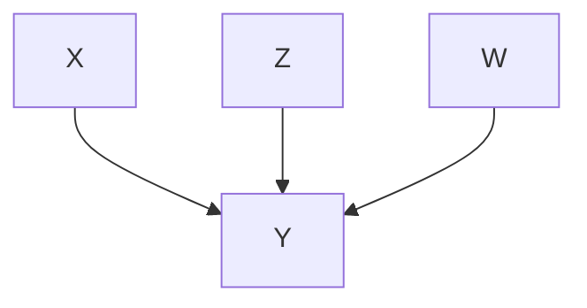
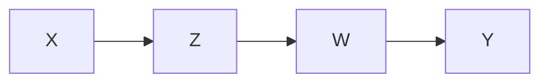

지난 글에서는 lemma들을 살펴보았고 이번에는 구체적인 알고리즘들과 계산 복잡성에 대해 다뤄보려고 한다.

<!--more-->

**Lemma 1**

> Assume that the input data $\mathbf{x}$ strictly follows the LiNGAM (2), that is, all the model assumptions are met and the sample size is infinite. Denote by $r_i^{(j)}$ the residual when $x_i$ is regressed on $x_j$: $r_i^{(j)}=x_i-\frac{Cov(x_i,x_j)}{Var(x_j)}x_j (i \neq j)$. Then a variable $x_j$ is exogenous if and only if $x_j$ is independent of its residuals $r_i^{(j)}$ for all $i \neq j$.

Lemma 1에서 가장 중요한 부분은 뭘까? 바로 **independency**를 확인하는 부분일 것이다. 

$y_1$과 $y_2$의 independency를 확인하는 measure로는 mutual information $MI(y_1,y_2)$가 있다(Hyvärinen et al., 2001). 그리고 Bach and Jordan(2002)에서는 이 mutual information을 kernel method를 활용하여 더욱 고도화시켰다.

$y_1,y_2$ 각각에 대해 $n$개씩의 observation이 있다고 해보자. 그럼 우리는 각각에 대해 $K_1,K_2$ matrix를 생각해볼 수 있는데, 원소들은 아래와 같다.

$$
K_1(i,j) = \exp \left( -\frac{1}{2\sigma^2}\|y_1^{(i)}-y_1^{(j)}\|^2 \right)
$$

$$
K_2(i,j) = \exp \left( -\frac{1}{2\sigma^2}\|y_2^{(i)}-y_2^{(j)}\|^2 \right)
$$

참고로 이 kernel은 Gaussian kernel이라고 한다. 보면 형태가 정규분포의 확률밀도함수와 흡사하다. 여기서 $\sigma>0$은 Gaussian kernel의 bandwith를 말하는데, $\sigma$가 작으면 작을수록 확률밀도함수가 뾰족해지는 모습을 상상하면 된다.

그리고 $\kappa$ 라는 작은 양의 상수를 하나 정의할 때, Bach and Jordan(2002)는 mutual information의 kernel-based estimator를 다음과 같이 제안하였다.

$$
\widehat{MI}_{kernel}(y_1,y_2)=-\frac{1}{2}\log\frac{\det \mathcal{K}_\kappa}{\det \mathcal{D}_\kappa}
$$

where

$$
\mathcal{K}_\kappa = \left[
\begin{matrix}
    (K_1+\frac{n\kappa}{2}I)^2 & K_1K_2 \\
    K_2K_1 & (K_2+\frac{n\kappa}{2}I)^2
\end{matrix}
\right] \\
$$

$$
\mathcal{D}_k = \left[
\begin{matrix}
    (K_1+\frac{n\kappa}{2}I)^2 & 0 \\
    0 & (K_2+\frac{n\kappa}{2}I)^2
\end{matrix}
\right] 
$$

논문을 보아하니 $\widehat{MI}_{kernel}$이 작으면 작을수록 independent하다고 보는 듯 하나, 아직 수학적인 유도까지는 제대로 이해하지 못했다. 나중에 ICA 알고리즘만 따로 깊게 공부해볼 필요가 있을 것 같다.

여기에서는 이 metric을 살짝 응용하여 사용하고 있다. $U=\\{1,2,\dots,p\\}$ 라고 정의했을 때, $x_j$와 residual $r_i^{(j)}=x_i-\frac{Cov(x_i,x_j)}{Var(x_j)}x_j$ 간의 independency는 아래 지표를 통해 평가한다.

$$
T_{kernel}(x_j;U)=\sum_{i \in U, i \neq j}{\widehat{MI}_{kernel}(x_j,r_i^{(j)})}
$$

즉, 각각의 $\widehat{MI}_{kernel}$을 단순합산하는 것이다. 아마 알고리즘에서는 **이 값이 가장 낮게 나오는 변수를 exogenous variable로 간주**하게 될 것이다.

### DirectLiNGAM Algorithm

&lt;DirectLiNGAM algorithm&gt;

1. p-dimensional vector $\mathbf{x}$, a set of variable subscripts $U$, 그리고 $p \times n$ data matrix $\mathbf{X}$가 주어진 상태이다. 이 때 $K:=\emptyset$, $m:=1$으로 변수선언을 한다.
2. $K$에 $p-1$개의 변수 인덱스가 담길 때까지 아래의 과정을 반복한다.
   1. 잔차들과 가장 독립인 변수 $x_m$을 찾는다. i.e.
   
        $$
        x_m = \arg\min_{j \in U-K} T_{kernel}(x_j;U-K)
        $$
            
    2. $K$에 $m$을 append한다.
    3. $\mathbf{x}:=\mathbf{r}^{(m)}, \mathbf{X}:=\mathbf{R}^{(m)}$ 으로 세팅한다.
3. 마지막으로 남은 변수의 인덱스를 $K$에 append한다.
4. $K$에 순서에 맞춰 strictly lower triangular matrix $\mathbf{B}$를 정의한다. 그리고, least square나 maximum likelihood 등의 방법을 통해 $b_{ij}$를 추정한다. 논문에서는 least square을 사용하고 있다고 한다.

### Computational Complexity

DirectLiNGAM 알고리즘의 계산 복잡성은 $O(np^3M^2+p^4M^3)$이다. 여기서 $M$은 low-rank decomposition을 통해 구한 maximal rank를 말한다고 한다. 만약 Gram matrices($K_1,K_2$)에 대한 low-rank approximation이 잘 이루어지지 않았다면 $M$이 크게 나타난다고 한다. 반면 기존의 ICA-LiNGAM 알고리즘의 계산복잡성은 $O(np^3+p^4)$d이다. 즉, 기본적으로 DirectLiNGAM 알고리즘이 더 복잡하지만 $M$의 크기에 따라 복잡도가 더욱 커질 수 있다는 문제점이 있기는 하다. 하지만, DirectLiNGAM은 convergence를 보장한다는 측면에서 이러한 단점을 안고갈 만하다고 주장하고 있다.

### Use of Prior Knowledge

알고리즘을 보면 알 수 있듯, 사전정보가 꼭 필요한 것은 아니다. 하지만 우리가 structure에 대한 정보가 있다면 계산을 줄일 수 있다는 점에서 의미가 있다. $\mathbf{A}^{\text{knw}}=a_{ji}^{\text{knw}}$ 라는 사전정보 행렬을 정의하자.

$$
a_{ji}^{\text{knw}}= 
\begin{cases}
    0 & \text{if }x_i \text{ does not have a directed path to }x_j \\
    1 & \text{if }x_i \text{ has a directed path to }x_j \\
    -1 & \text{if no prior knowledge is available to know if either of the two cases above (0 or 1) is true.}
\end{cases}
$$

이 사전정보 행렬의 특성을 조금만 더 끌고 나가면 증명할 필요도 없이 당연한 세개의 lemma들을 끌어낼 수 있다.

**Lemma 3**

> Assume that the input data $\mathbf{x}$ strictly follows the LiNGAM. An observed variable $x_j$is exogenous if $a_{ji}^{\text{knw}}$ is zero for all $i \neq j$.

**Lemma 4**

> Assume that the input data $\mathbf{x}$ strictly follows the LiNGAM. An observed variable $x_j$ is endogenous, that is, not exogenous, if there exist such $i \neq j$ that $a_{ji}^{\text{knw}}$ is unity.

**Lemma 5**

> Assume that the input data $\mathbf{x}$ strictly follows the LiNGAM. An observed variable $x_j$ does not receive the effect of $x_i$ if $a_{ji}^{\text{knw}}$ is zero.

그렇다면 어떻게 이 사전정보를 알고리즘에 반영할 수 있을까?

우리가 앞서 확인한 &lt;DirectLiNGAM algorithm&gt;에서 2-1 부분에 몇 단계만 더 추가해주면 된다.

**STEP 2-1-1**

$\mathbf{A}^{\text{knw}}$에서 exogenous variable을 찾는다. 즉, $x_j$ ($j \in U-K$) such that $j$-th row of $\mathbf{A}^{\text{knw}}$ has zero in the $i$-th column **for all** $i \in U-K \; (i \neq j)$. 그리고 이 변수들의 인덱스를 모두 집합 $U_{exo}$에 추가한다.

* $U_{exo}$가 empty set이 아닌 경우(사전정보를 통해 알게 된 exogenous variable이 하나 이상 존재할 경우) : $U_c:=U_{exo}$로 $U_c$를 정의.
* $U_{exo}$가 empty set인 경우(사전정보를 통해 알게 된 exogenous variable이 따로 존재하지 않을 경우): 내생변수들을 모두 찾아 해당 변수들의 인덱스를 $U_{end}$에 추가한다. 즉, $x_j$ ($j \in U-K$) such that $j$-th row of $\mathbf{A}^{\text{knw}}$ has unity in the $i$-th column **for at least one of** $i \in U-K \; (i \neq j)$. 그 다음 $U_c:=U-K-U_{end}$로 $U_c$를 정의.

대충 느낌을 보아할 때 $U_c$ 안에서만 알고리즘을 돌리면 충분하다는 점을 활용하는 것 같다. 사전정보를 반영하지 못했을 경우에는 전체 variable set $U \; (\lvert U \rvert=p)$ 에서부터 반복문을 시작해야 했지만, $\lvert U_c \rvert \leq \lvert U \rvert$ 라는 점을 통해 계산상의 이득을 보고자 하고 있다.

**STEP 2-1-2**

$U_c$에 있는 변수들에 대해 direct path가 없는 변수들을 찾아 그 인덱스들을 $V^{(j)}$에 추가한다. 즉, $x_i \; (i \in U-K, i \neq j)$ such that $a_{ij}^{\text{knw}}=0$ for all $j \in U_c$. $V^{(j)}$에 있는 변수들은 우리가 외생 변수와 전혀 관계가 없음을 알고 있기 때문에 굳이 regression을 따로 해줄 필요가 없다. 수학적으로 표현하자면 $Cov(x_{V^{(j)}},x_{U_c})=0$. 따라서 $r_i^{(j)}:=x_i \;\; (i \in V^{(j)})$로 그냥 두면 된다. 그 다음 남은 변수들에 대해 regression을 진행하면서 $\mathbf{r}^{(j)}$와 $\mathbf{R}^{(j)}$를 만들면 된다.

그렇게

$$
x_m = \arg\min_{j \in U_c} T_{kernel}(x_j;U-K)
$$

을 다시 찾으면 된다. 만약 $U_c$에 인덱스가 하나밖에 없다면 그 인덱스의 변수가 $x_m$이 된다.

---

여기까지 구체적인 알고리즘을 살펴보았다. 한 가지 이해가 잘 안되고 또 마음에 들지 않는 것이 있다면 $U_{exo}$가 empty set이 아닌 경우 $U_c:=U_{exo}$로 그대로 $U_c$를 정의해버렸다는 것이다. 알고리즘을 보면 $U_c$안에서 ordering을 매기는 것을 확인할 수 있다. 만약 $U_{exo}$에 하나의 인덱스밖에 없다면 문제가 되지 않겠지만, 하나 이상이 존재할 경우에는 다음과 같은 문제가 존재할 수도 있겠다는 생각이 든다.

즉,

이 맞는 모형이지만 어떤 순서가 매겨져

로 잘못 estimate될 수도 있을 것 같다. 내가 이해한 것이 틀렸을 수도 있지만, 만약 맞다면 굳이 알고리즘을 이렇게 strict하게 만들 필요가 있을까 싶다.

다음 글에서는 실제 데이터를 모형이 얼마나 잘 설명하는지 다뤄보겠다.

  

## Reference

* <a href="https://www.jmlr.org/papers/volume12/shimizu11a/shimizu11a.pdf">DirectLiNGAM: A Direct Method for Learning a Linear non-Gaussian Structural Equation Model</a>

* <a href="https://www.sciencedirect.com/science/article/pii/S0893608000000265?casa_token=hsj1ZKquP8sAAAAA:b4YCyZ6n3ynogaMdwUzgiQNOj0IQXbGmWzalkVh9ma2pNt2MVMZOtqvJnbgQQoGVcQOGmeqB0eU">Independent component analysis: algorithms and applications</a>

* <a href="https://www.jmlr.org/papers/volume3/bach02a/bach02a.pdf">Kernel independent component analysis</a>